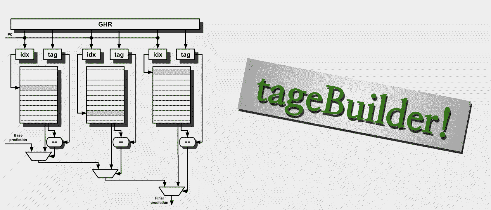

+++
image = "tagebuilder_thumb.png"
date = "2025-01-04"
draft = false
title = 'tageBuilder'
type = "post"
github = 'https://github.com/wonjongbot/tageBuilder'
+++
_Python-based sim/eval tool for TAGE-like branch predictors._
<!--more-->


## Overview
tageBuilder is a Python-based simulator and performance evaluation tool for TAGE-like branch predictors. It offers configurable parameters for modeling TAGE predictors and is optimized for performance with Numba and NumPy. Predictor performance can be evaluated with 200+ branch trace datasets from the 2016 Championship Branch Prediction (CBP2016) environment and generates detailed performance metrics.

> TAGE predictors are state-of-the-art branch predictor design. If you are curious about their details, check out [resources](#resources).

## Features

- **Customizable Predictor Model:**  
  Configure aspects such as tagged components (number, history length, tag width) and base predictor settings (prediction bits, hysteresis bits) via a YAML spec file.

  _The tool does not model non-tagged components (except for the base predictor) such as the loop predictor and the statistical corrector._

  A predictor with 12 tagged components with total space of 212Kb scored accuracy of 95%> and MPKI of 1~3 for most traces.

- **Optimized Simulation:**  
  Uses Numba JIT and NumPy vectorized operations to process ~700,000 branch sequences per second per simulation process.

- **Batch Processing:**  
  Supports batch prediction and updates for efficient data flow.

- **Real-World Trace Integration:**  
  Works with BT9-formatted branch trace files from CBP2016, reverse-engineered to meet the tool’s requirements.

- **Comprehensive Evaluations:**  
  Generates metrics and visualizations including MPKI, accuracy graphs, memory usage charts, misprediction statistics, branch class analysis, and CSV outputs for further analysis.

- **Parallel Processing:**  
  Runs multiple traces in parallel processes to speed up evaluations.
  
## Technical Details

_currently adding more details_
 
### Configuration

TAGEbuilder uses a YAML configuration file to define predictor parameters. This allows users to easily adjust the following:
- Number and configuration of tagged components
- Base predictor settings (e.g., prediction bits, hysteresis bits)
- Global predictor parameters (e.g., path history length, usefulness bit duration)

Below is an example predictor spec with one base bimodal predictor and 4 tagged predictors.

```yaml
global_config:
    phist_len: 16
    u_duration_log: 19
tables:
    - name: base
      isBase: true
      hist_len: 0
      num_pred_entries_log: 14
      num_hyst_entries_log: 12
      tag_width: 0

    - name: t1
      isBase: false
      hist_len: 8
      num_pred_entries_log: 10
      num_hyst_entries_log: 0
      tag_width: 8

    - name: t2
      isBase: false
      hist_len: 12
      num_pred_entries_log: 10
      num_hyst_entries_log: 0
      tag_width: 9

    - name: t3
      isBase: false
      hist_len: 18
      num_pred_entries_log: 10
      num_hyst_entries_log: 0
      tag_width: 9

    - name: t4
      isBase: false
      hist_len: 27
      num_pred_entries_log: 10
      num_hyst_entries_log: 0
      tag_width: 10

```

### Data Input

The tool accepts branch trace files in the BT9 format, compatible with the CBP2016 traces. 

### Output

_check `tageBuilder/docs/example_sim_output.tar.gz` for output example._

TAGEbuilder produces several outputs:
- Visualizations for memory usage by predictor components


- Graphs for MPKI and accuracy


- Statistics on mispredictions per branch PC and branch class analysis


- CSV files summarizing simulation results (per predictor, per branch PC address, general MPKI/accuracy)

## Performance & Benchmarks
_currently adding more details_

## Things Learned

_currently adding more details_

## Applications

Primary application is to aid high performance CPU design with fast branch predictor prototyping.
